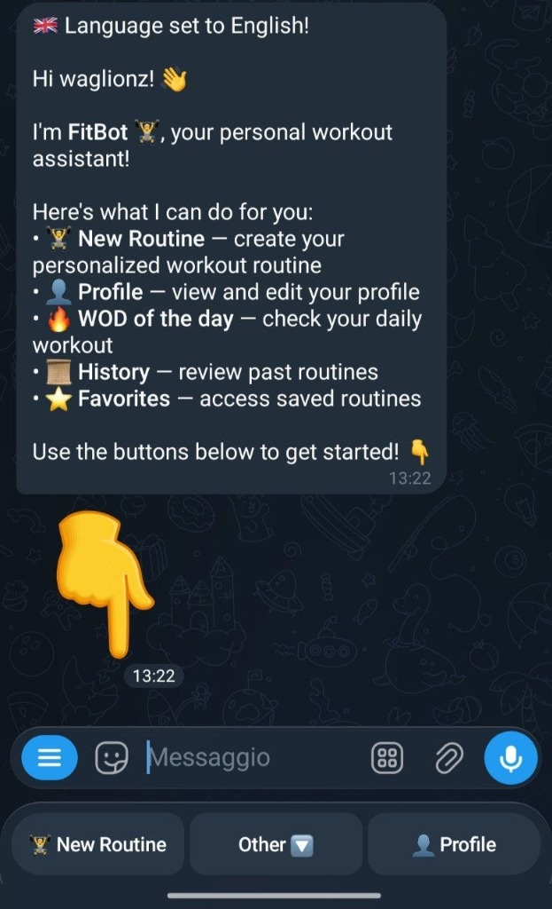
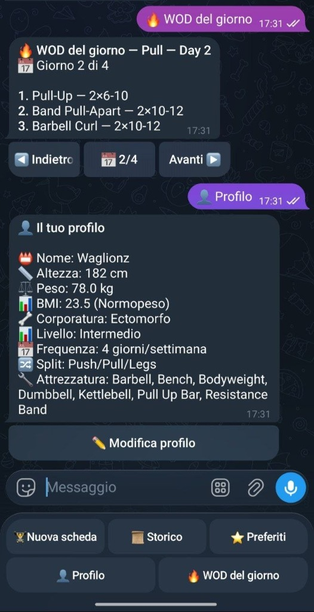

<p align="center">
  
</p>

<h1 align="center">🏋️ FitBot — Workout of the Day Telegram Bot</h1>

<p align="center">
  <em>Personalized workout routine generator, accessible via Telegram Bot.</em>
</p>

<p align="center">
  
  
  
  
</p>

<p align="center">
  
  
  
  
</p>

---

## 📖 Table of Contents

- [Overview](#-overview)
- [Bot Features and Commands](#-bot-features-and-commands)
- [UX Screenshots](#-ux-screenshots)
- [Project Architecture](#-project-architecture)
- [Repository Structure](#-repository-structure)
- [Installation Guide](#-installation-guide)
- [Development and Code Quality](#-development-and-code-quality)
- [Testing](#-testing)
- [CI/CD Pipeline](#-cicd-pipeline)
- [Tech Stack](#-tech-stack)

---

## 🎯 Overview

**FitBot** is a Telegram Bot designed to generate personalized workout routines (WOD — *Workout of the Day*) based on the user's physical profile, experience level, and available equipment.

The project was developed following **Quality Development** principles with a focus on:

- ✅ **Decoupled core logic** — business logic is completely separated from the Telegram interface
- ✅ **Testable architecture** — each layer can be tested in isolation
- ✅ **Test coverage ≥ 75%** — automatically enforced in the CI pipeline
- ✅ **Complete static analysis** — Black, isort, Flake8, Pylint, Mypy (strict mode)
- ✅ **Pre-commit hooks** — guaranteed quality on every commit
- ✅ **CI/CD with GitHub Actions** — automated linting + testing on every push/PR

---

## 🤖 Bot Features and Commands

| Command / Button | Emoji | Description |
|---|---|---|
| `/start` | 👋 | Starts the bot and shows the main menu with all available commands |
| **Nuova scheda (New Routine)** | 🏆 | Creates a new personalized workout routine via a guided onboarding process. The user inputs their data (level, frequency, split, equipment) or uses their existing profile |
| **Profilo (Profile)** | 👤 | Displays the full user profile with all personal information (name, height, weight, BMI, body type, level, frequency, split, equipment). Includes option to edit the profile |
| **🔥 WOD del giorno (WOD of the day)** | 🔥 | Shows the Workout of the Day — the daily workout based on the active routine, with navigation between days of the week (Back/Forward) |
| **📜 Storico (History)** | 📜 | Review past generated workout routines, with the ability to download them in PDF or TXT format |
| **⭐ Preferiti (Favorites)** | ⭐ | Access favorited routines for quick access to your most appreciated workouts |

### User Flow

```
/start → Main Menu
           ├── 🏆 Nuova scheda → Onboarding (level, frequency, split, equipment) → Generated routine
           ├── 👤 Profilo → View/Edit personal data
           ├── 🔥 WOD del giorno → Daily navigation of the active routine
           ├── 📜 Storico → List of past routines → Download PDF/TXT
           └── ⭐ Preferiti → Saved routines
```

---

## 📱 UX Screenshots

Below are the main screens of the Telegram bot interface:

<table>
  <tr>
    <td align="center" width="33%">
      
      <br/>
      <b>/start Command</b>
      <br/>
      <sub>The bot greets the user with a welcome message and shows the full list of available commands. Quick menu buttons are present at the bottom.</sub>
    </td>
    <td align="center" width="33%">
      
      <br/>
      <b>WOD of the Day & Profile</b>
      <br/>
      <sub>Top: The WOD shows the daily workout with day-by-day navigation. Bottom: The user profile with all personal data and BMI calculation.</sub>
    </td>
    <td align="center" width="33%">
      
      <br/>
      <b>Favorites</b>
      <br/>
      <sub>List of routines saved as favorites, including date/time and program type. Tap a routine to view it.</sub>
    </td>
  </tr>
</table>

---

## 🏗️ Project Architecture

The project follows a **three-layer architecture** with a clear separation of concerns, designed to maximize testability and decoupling:

```
┌─────────────────────────────────────────────────┐
│                  Telegram Bot                    │
│           (Handlers & Keyboards)                 │
│          src/wod/bot/                            │
├─────────────────────────────────────────────────┤
│                  Core Logic                      │
│    (Engine, Split Generator, BMI, Intensity)     │
│          src/wod/core/                           │
├─────────────────────────────────────────────────┤
│                  Data Layer                      │
│     (SQLAlchemy Models & Repositories)           │
│          src/wod/db/                             │
└─────────────────────────────────────────────────┘
```

### Layer Details

| Layer | Path | Responsibility | Quality Principle |
|---|---|---|---|
| **Bot** | `src/wod/bot/` | Telegram Interface — command handling, keyboards, message formatting | Thin controller — no business logic |
| **Core** | `src/wod/core/` | Domain logic — exercise filtering, split generation, BMI and intensity calculation | Pure business logic with no external dependencies |
| **DB** | `src/wod/db/` | Persistence — SQLAlchemy models, repository pattern, data seeding | Repository pattern to isolate data access |
| **Config** | `src/wod/config.py` | Centralized configuration via Pydantic Settings | Automatic validation, type-safe |

### Architectural Principles

- **Dependency Inversion** — Higher layers do not depend on the concrete implementation of lower layers
- **Repository Pattern** — Data access is encapsulated in dedicated repositories, simplifying mocking and testing
- **Pure Functions** — Core logic is implemented as pure functions, easily testable without complex setup
- **Configuration as Code** — All settings are managed via `pydantic-settings` with automatic validation

---

## 📂 Repository Structure

```
FitBot-Generator/
├── .github/
│   └── workflows/
│       └── ci.yml                  # GitHub Actions — lint + test pipeline
├── data/
│   └── seed_exercises.json         # Exercise catalog for DB seeding
├── docs/
│   └── screenshots/                # UX screenshots of the bot
├── scripts/
│   └── seed_db.py                  # Script for manual database seeding
├── src/
│   └── wod/
│       ├── __init__.py
│       ├── config.py               # App configuration (Pydantic Settings)
│       ├── bot/                    # 🤖 Telegram Layer
│       │   ├── main.py             # Entry point — assembles handlers and starts polling
│       │   ├── keyboards.py        # Inline and reply keyboards
│       │   ├── formatters.py       # Message formatting for the user
│       │   ├── utils.py            # Shared bot utilities
│       │   └── handlers/           # Command handlers
│       │       ├── onboarding.py   # Registration and routine creation flow
│       │       ├── menu.py         # Main menu and navigation
│       │       ├── profile.py      # Profile view and editing
│       │       ├── wod.py          # WOD of the day and navigation
│       │       ├── history.py      # Routines history + PDF/TXT export
│       │       └── favorites.py    # Favorite routines management
│       ├── core/                   # 🧠 Business Logic Layer
│       │   ├── types.py            # Enums and domain value objects
│       │   ├── engine.py           # Exercise filtering by equipment and muscles
│       │   ├── split_generator.py  # Weekly split generation
│       │   ├── intensity.py        # Sets, reps, and intensity calculation
│       │   └── bmi.py              # BMI calculation (WHO classification)
│       └── db/                     # 💾 Persistence Layer
│           ├── models.py           # SQLAlchemy Models (User, Exercise, Routine, etc.)
│           ├── repositories.py     # Repository pattern for data access
│           ├── session.py          # Async database session management
│           └── seeding.py          # Auto-seeding of the exercise catalog
├── tests/                          # 🧪 Test Suite
│   ├── conftest.py                 # Shared fixtures (In-memory DB, mocks)
│   ├── test_config.py              # Configuration tests
│   ├── bot/                        # Bot layer tests
│   │   ├── test_main.py            # Entry point and handler registration tests
│   │   ├── test_keyboards.py       # Keyboards and layout tests
│   │   ├── test_formatters.py      # Message formatting tests
│   │   ├── test_utils.py           # Utilities tests
│   │   ├── test_onboarding.py      # Onboarding flow tests
│   │   ├── test_profile.py         # Profile management tests
│   │   └── test_wod_helpers.py     # WOD helper tests
│   ├── core/                       # Core layer tests
│   │   ├── test_bmi.py             # BMI calculation tests
│   │   ├── test_engine.py          # Exercise filtering tests
│   │   ├── test_intensity.py       # Intensity calculation tests
│   │   ├── test_split_generator.py # Split generation tests
│   │   └── test_types.py           # Domain types tests
│   └── db/                         # DB layer tests
│       ├── test_models.py          # Models tests
│       ├── test_repositories.py    # Repository pattern tests
│       ├── test_seeding.py         # Data seeding tests
│       └── test_session.py         # DB sessions tests
├── .coveragerc                     # Code coverage configuration
├── .flake8                         # Flake8 configuration
├── .pre-commit-config.yaml         # Pre-commit hooks
├── .pylintrc                       # Pylint configuration
├── mypy.ini                        # MyPy configuration
├── pyproject.toml                  # Project and dependencies configuration
└── README.md
```

---

## 🚀 Installation Guide

### Prerequisites

- **Python 3.11+** — [Download](https://www.python.org/downloads/)
- **Git** — [Download](https://git-scm.com/)
- **Telegram Bot Token** — Obtainable via [@BotFather](https://t.me/BotFather) on Telegram

### Step 1 — Clone the repository

```bash
git clone https://github.com/SimoneAndreaCilia/FitBot-Generator.git
cd FitBot-Generator
```

### Step 2 — Create and activate the virtual environment

```bash
# Create the virtual environment
python -m venv .venv

# Activate the virtual environment
.venv\Scripts\activate          # Windows (PowerShell / CMD)
# source .venv/bin/activate     # macOS / Linux
```

### Step 3 — Install dependencies

```bash
# Install the project in editable mode with development dependencies
pip install -e ".[dev]"
```

### Step 4 — Configure environment variables

```bash
# Create the .env file from the template
cp .env.example .env
```

Edit the `.env` file and insert your Telegram token:

```ini
TELEGRAM_BOT_TOKEN=your-token-here
```

> [!TIP]
> To get a token, open Telegram, search for **@BotFather**, send `/newbot` and follow the instructions.

### Step 5 — Start the bot

```bash
# Start the bot in long-polling mode
wod-bot
```

The bot will connect to Telegram and start receiving messages. Search for your bot on Telegram and send `/start` to begin! 🎉

---

## 🔧 Development and Code Quality

This project implements a **comprehensive quality toolchain**, aligning with the best practices of the **Quality Development** subject.

### Pre-commit Hooks

The project uses `pre-commit` to ensure the code meets formatting and quality standards **before every commit**.

```bash
# Install pre-commit
pip install pre-commit

# Install pre-commit hooks in the local repository
pre-commit install
```

The following checks run automatically on every `git commit`:

| Hook | Tool | Function |
|---|---|---|
| Trailing whitespace | pre-commit | Removes trailing whitespace |
| End-of-file fixer | pre-commit | Ensures a blank line at the end of files |
| YAML check | pre-commit | Validates YAML syntax |
| Code formatting | **Black** | Automatic code formatting |
| Import sorting | **isort** | Automatic import sorting |
| Style checking | **Flake8** | PEP 8 style checking |
| Static analysis | **Pylint** | Deep static analysis |
| Type checking | **MyPy** | Strict mode type checking |

### Manual Execution

You can run checks manually without making a commit:

```bash
# Run all pre-commit checks
pre-commit run --all-files

# Or run individual tools:
black src/ tests/                # Code formatting
isort src/ tests/                # Import sorting
flake8 src/ tests/               # Style checking
pylint src/wod/                  # Static analysis
mypy src/wod/                    # Type checking
```

---

## 🧪 Testing

The test suite is structured to mirror the three layers of the architecture:

```
tests/
├── core/    → Unit tests for business logic (pure, without I/O)
├── bot/     → Telegram handlers tests (with API mocking)
└── db/      → Persistence layer tests (in-memory DB)
```

### Running tests

```bash
# Run all tests with coverage report
pytest

# Run tests for a specific layer only
pytest tests/core/               # Core logic only
pytest tests/bot/                # Bot handlers only
pytest tests/db/                 # Database only

# Run a single test file
pytest tests/core/test_bmi.py

# Run with verbose output
pytest -v --tb=short
```

### Coverage Configuration

The minimum coverage is set to **75%** and is verified automatically:

```ini
# pyproject.toml
[tool.pytest.ini_options]
addopts = [
    "--strict-markers",
    "--cov=src/wod",
    "--cov-report=term-missing",
    "--cov-fail-under=75",
]
```

> [!IMPORTANT]
> If the coverage drops below 75%, the tests will fail both locally and in the CI pipeline.

---

## ⚙️ CI/CD Pipeline

The project uses **GitHub Actions** for continuous integration. The pipeline runs automatically on every `push` and `pull_request` to the `main` branch.

```
CI Pipeline
│
├── 🔍 Job: Lint & Type-check
│   ├── black --check          (formatting)
│   ├── isort --check-only     (import sorting)
│   ├── flake8                 (PEP 8 style)
│   ├── pylint                 (static analysis)
│   └── mypy                   (strict type checking)
│
└── 🧪 Job: Tests (depends on Lint)
    └── pytest --cov --cov-fail-under=75
```

> [!NOTE]
> The test job runs **only if** the linting job passes all checks, ensuring the code meets quality standards before verifying functional correctness.

---

## 🛠️ Tech Stack

| Technology | Version | Role |
|---|---|---|
| [Python](https://www.python.org/) | 3.11+ | Main Language |
| [python-telegram-bot](https://python-telegram-bot.org/) | 21.x | Telegram Bot API Framework |
| [SQLAlchemy](https://www.sqlalchemy.org/) | 2.0 | ORM and Database Management |
| [aiosqlite](https://github.com/omnilib/aiosqlite) | 0.20+ | Async SQLite driver |
| [Pydantic](https://docs.pydantic.dev/) | 2.0 | Data validation and configuration |
| [ReportLab](https://www.reportlab.com/) | 4.0 | PDF file generation |
| [pytest](https://docs.pytest.org/) | 8.0 | Testing framework |
| [Black](https://black.readthedocs.io/) | 24.x | Automatic code formatter |
| [MyPy](https://mypy.readthedocs.io/) | 1.8+ | Static type checker (strict) |
| [Pylint](https://pylint.readthedocs.io/) | 3.x | Static code analyzer |
| [Flake8](https://flake8.pycqa.org/) | 7.0 | PEP 8 style checker |
| [GitHub Actions](https://github.com/features/actions) | — | CI/CD pipeline |

---

<p align="center">
  Developed as a project for the <strong>Quality Development</strong> course 💪
</p>
